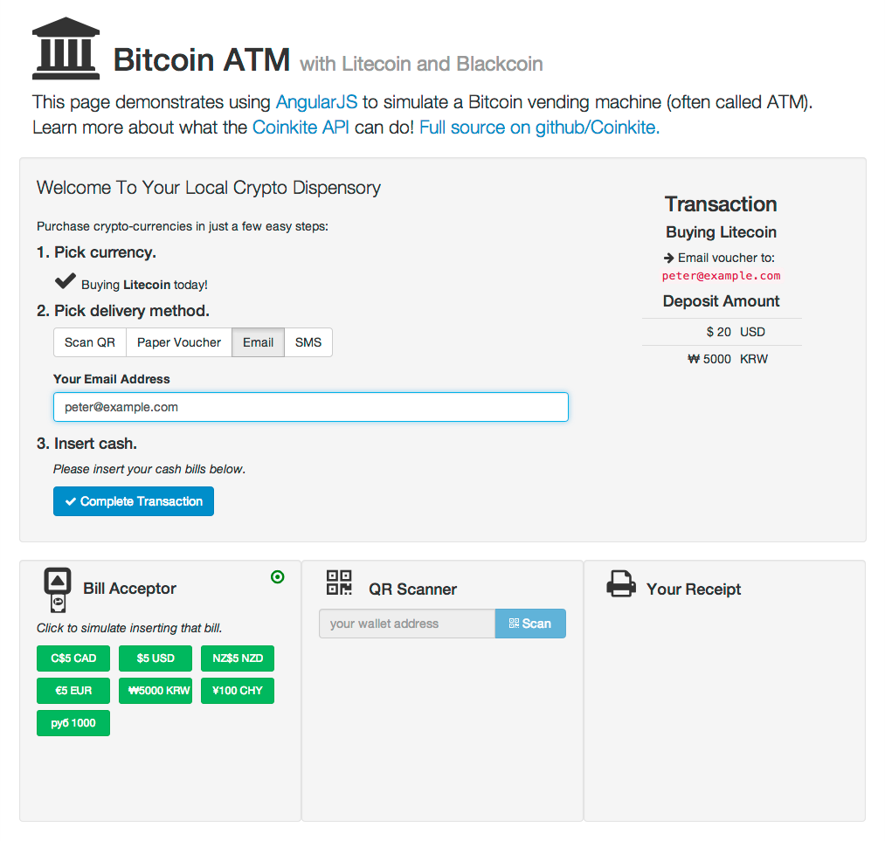

# Coinkite API Browser in [AngularJS](https://angularjs.org/)

[Learn more about Coinkite's API here](https://docs.coinkite.com/)
and visit the [Coinkite Main Site](https://coinkite.com/) to open your
account today!

## Setup

Use you favourite micro webserver to server `index.html` from this directory.
You can do this easily with Python (which is probably already installed).

    python -m SimpleHTTPServer

... and then surf to <http://localhost:8000> using a modern browser.

When you get tired of cut-n-pasting your API key and secret, create a file
in this directory called `my-keys.json` and it will be used to prefill those
fields.

Example `my-keys.json` file:

    {
        "api_key": "K11aaa11a-aa11a111-a11aaa11111a1aa1",
        "api_secret": "Saa1a1aa1-11a11111-aa111aa1111aa111"
    }

## Requirements

For this demo, we are using:

- AngularJS <https://docs.angularjs.org>
- Bootstrap <http://getbootstrap.com/>
- AngularStrap <http://mgcrea.github.io/angular-strap>
- Restangular <https://github.com/mgonto/restangular>
- lodash (required by Restangular) <http://lodash.com/>
- font-awesome <http://fontawesome.io/>
- crypto-js (just HMAC-SHA256) <https://code.google.com/p/crypto-js/>

All these files, except `json-print`, are being provided by CDN sources
to make this package lighter.

## Discussion

This example is using `$http` for the main JSON resource fetching. However,
the typeahead feature fetches its data via Restangular. All API
endpoints (except under `/public/`) require authentication with an API
key and secret. The keys you need can be created on
[Coinkite.com under Merchant / API]([https://coinkite.com/merchant/api)

See `coinkite-api.js` for the tricky bits: it will generate the
required headers for your HTTP request and works under both
`node.js` and in the browser.

This is a **DEMO** program, and we would never recommend putting
API secret keys into browser-side code in any other case.

## Screenshot

## More about Coinkite

Coinkite is the world's easiest and most powerful web wallet for
safely holding all your cryptocurrencies, including Bitcoin and Litecoin.

[Learn more about all we offer](https://coinkite.com/)

